# PAP — Screen Reference (Figma)

Mobile screens for the PAP / AuthPortal sign-in and account-creation flow, exported from the [SSO Figma](https://www.figma.com/design/WjOfX2phnwdS2Go0iPDNSY/SSO?node-id=738-1863). Images live in [`figma/`](./figma/). Prototype flow connectors (decision labels) live in [`figma/prototype-flow/`](./figma/prototype-flow/).

These will drive the visual/UI test scenarios once the [test-user login blocker](./test-user-login-concerns.md) is resolved.

## Entry — Welcome (feature_203 → WelcomeV2)

The new Welcome screen with three entries: **Technicians** pill (top-left), help icon (top-right), **Amazon sign-in** (primary), **Email or phone number** (secondary → PAP flow), and the account-linking footnote ("Linking accounts enables certain Amazon features… Learn more").

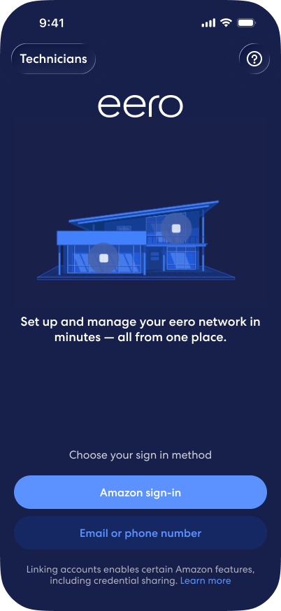

## Retail path — Amazon sign-in (AuthPortal)

Existing retail Amazon-login AuthPortal (light theme, "an amazon company", yellow Continue). Reached from **Amazon sign-in**. Association handle `amzn_eero_mobile_android_us`. Unchanged by this project — included for contrast.

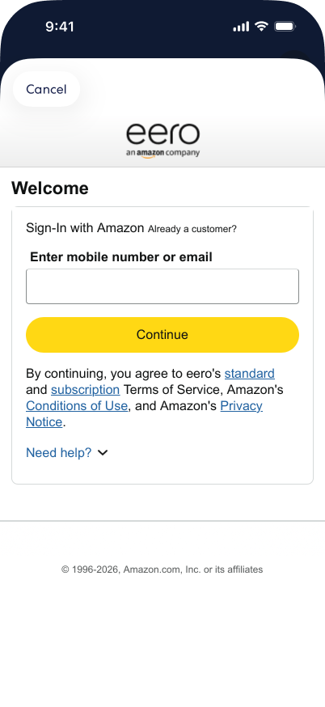

## PAP path — Sign in or create account (eero-branded AuthPortal)

Reached from **Email or phone number**. eero-branded dark theme, "Enter email or phone number", blue Continue, ToS/Privacy links, "Need help?". Association handle `amzn_eero_mobile_us`, AuthPortal domain `ap.account.eero.com`.

| State | Screen |
|-------|--------|
| Empty field | 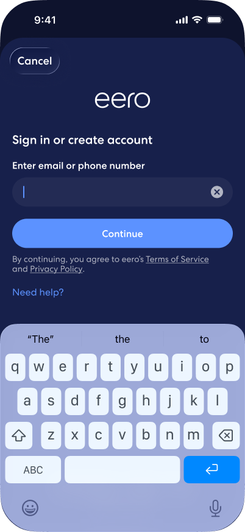 |
| Email entered | 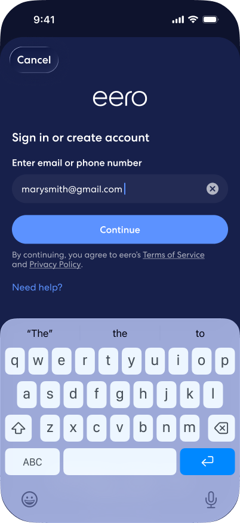 |
| Phone entered (US +1 country selector) | 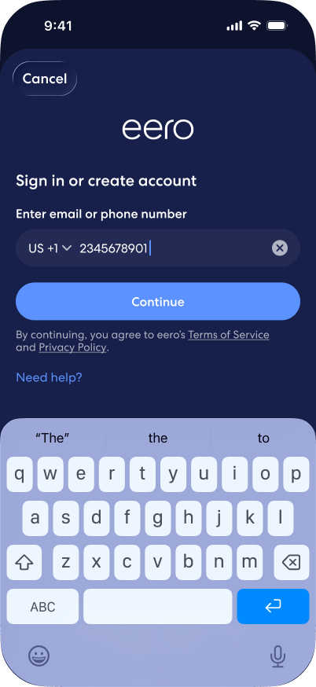 |

## Existing user — OTP verification

After Continue with an existing claim, the user gets a security code. "Change" edits the claim; "Resend code".

| State | Screen |
|-------|--------|
| Verify email — code empty | 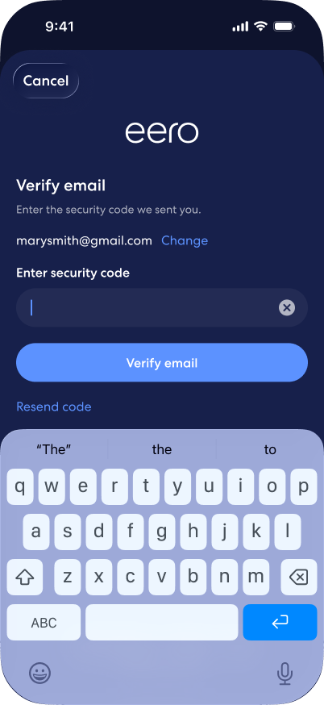 |
| Verify email — code entered | 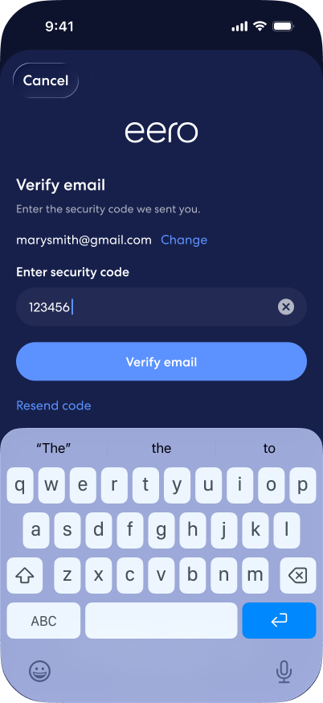 |
| Verify mobile — code empty | 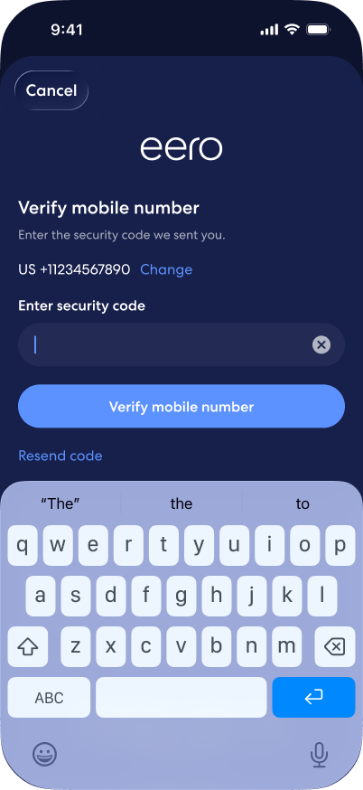 |
| Verify mobile — code entered | 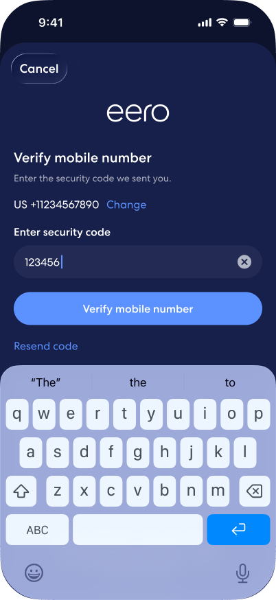 |

## New user — create account (UnifiedCX)

When the claim has no PAP account: "Looks like you're new to eero" → **Proceed to create an account** → name entry. "Already a customer? Sign in with another email or phone number" offers a way back.

| State | Screen |
|-------|--------|
| New to eero (email) |  |
| New to eero (phone) | 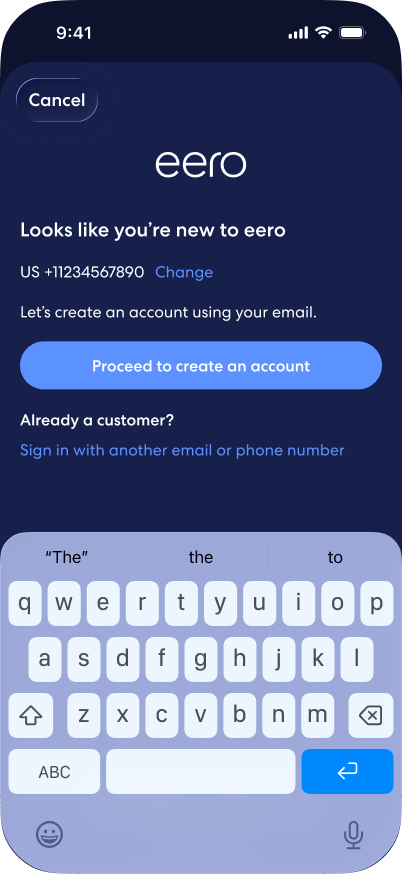 |
| Create account (email) — name empty | 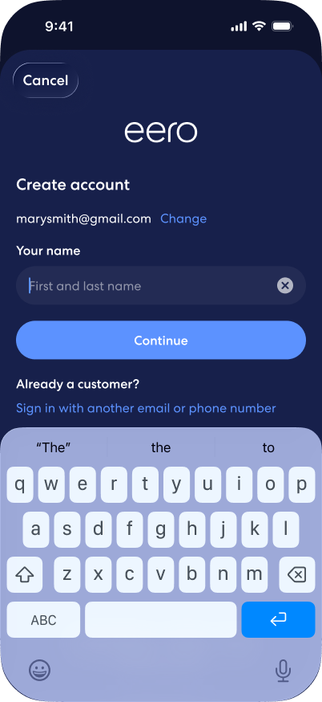 |
| Create account (email) — name filled | 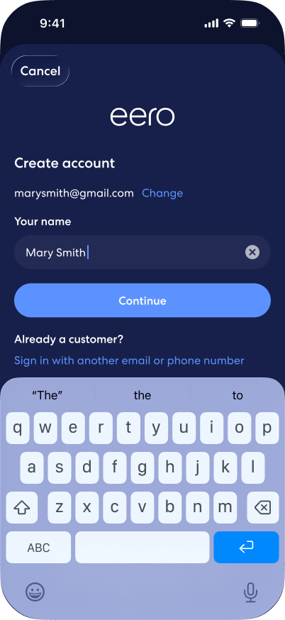 |
| Create account (phone) — name empty | 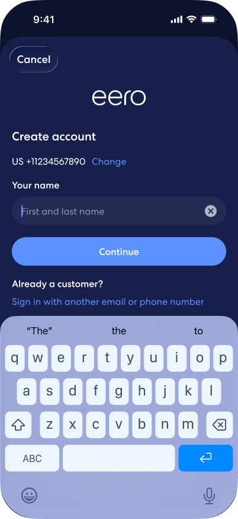 |
| Create account (phone) — name filled | 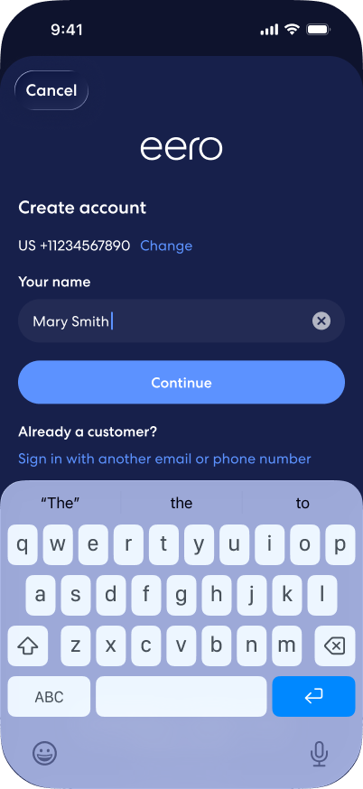 |

## Prototype flow connectors

The `Link*` PNGs in [`figma/prototype-flow/`](./figma/prototype-flow/) are Figma prototype connectors, not UI. They carry the flow-decision labels between screens, notably:

- **Enter Email** — proceed with the entered claim
- **Account Doesn't Exist** — branch to the new-user / create-account path
- **Open PAP Webview** — open the MAP/AuthPortal web view
- **Choose Amazon** — route to the retail Amazon sign-in path

## Filename → Figma frame mapping

UI screens were renamed for clarity; original Figma frame names:

| File | Original Figma frame |
|------|----------------------|
| 01-welcome-v2.png | Intro |
| 02-amazon-signin-authportal.png | Sign-In (Amazon) |
| 03-pap-signin-empty.png | Sign In or Create Account (eero PAP) [Show Keyboard] |
| 04-pap-signin-email-entered.png | Mobile Number-1 |
| 05-pap-signin-phone-entered.png | Mobile Number |
| 06-pap-new-user-email.png | …[Show Keyboard]-2 |
| 07-pap-new-user-phone.png | …[Show Keyboard]-7 |
| 08-pap-create-account-email-name-empty.png | …[Show Keyboard]-3 |
| 09-pap-create-account-email-name-filled.png | …[Show Keyboard]-5 |
| 10-pap-create-account-phone-name-empty.png | …[Show Keyboard]-4 |
| 11-pap-create-account-phone-name-filled.png | …[Show Keyboard]-6 |
| 12-pap-verify-email-otp-empty.png | …[Show Keyboard]-8 |
| 13-pap-verify-email-otp-filled.png | …[Show Keyboard]-10 |
| 14-pap-verify-phone-otp-empty.png | …[Show Keyboard]-1 |
| 15-pap-verify-phone-otp-filled.png | …[Show Keyboard]-9 |
