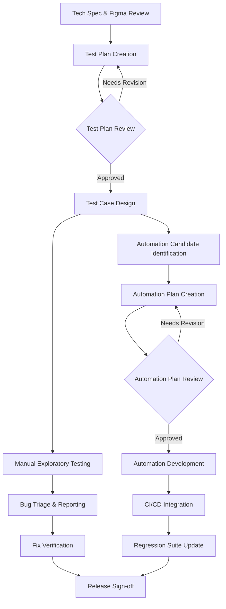

# QA Process Planning Skill

Generate three QA artifacts from project inputs (tech spec, Figma designs, project description): a quality process flowchart, a test plan, and an automation plan (with a companion unique IDs document for E2E automation).

## Agents

- **Quality Process Flowchart**: Use the `lead-quality-assurance-engineer` agent.
- **Test Plan**: Use the `lead-quality-assurance-engineer` agent.
- **Automation Plan**: Use both the `lead-quality-assurance-engineer` and `lead-software-developer-in-test` agents (collaborate on strategy and implementation details).

## Inputs

Before generating artifacts, ask the user:

> Do you have any existing documentation for this project? This could include tech specs, Figma designs, PRDs, architecture diagrams, API docs, user stories, or any other relevant materials. Please share whatever is available — links, files, or paste the content directly.

From what they provide, identify and extract:

1. **Project description** — what is being built, scope, and goals
2. **Tech spec** — architecture, APIs, data models, integrations, platforms
3. **Figma designs** — screens, user flows, states, edge cases visible in the UI

If critical inputs are missing after reviewing the provided documentation, ask the user to fill the gaps before proceeding.

## Artifact 1: Quality Process Flowchart

Generate a Mermaid flowchart showing the end-to-end QA process for the feature. This is shared with Engineering to align on quality gates.

After generating the Mermaid code, provide the user with these instructions:

> **To render your flowchart:**
>
> **Option 1 — Amazon Internal Mermaid Editor (recommended)**
> 1. Go to [console.harmony.a2z.com/mermaid-live-editor](https://console.harmony.a2z.com/mermaid-live-editor/)
> 2. Paste the code above
> 3. Export as PNG or SVG
>
> **Option 2 — Amazon Wiki**
> Mermaid diagrams render natively in Amazon Wiki pages — just wrap the code in a mermaid block.
>
> ⚠️ **Do not use external mermaid editors** — use the internal Harmony service to protect confidential information.

### Structure



### Requirements

- Adapt the flow to the specific feature — add/remove nodes as needed
- Include decision points for reviews and approvals
- Show parallel tracks (manual testing + automation) where applicable
- Mark quality gates explicitly (review checkpoints, sign-off criteria)
- Use clear, non-technical labels suitable for cross-functional sharing
- Output must be valid Mermaid syntax that renders without errors

## Artifact 2: Test Plan Documentation

Generate a test plan following the required template structure below. Fill in all sections based on the project documentation provided.

### Template

```markdown
# QA test plan

**<Project Name> - QA test plan**

**Version**: <Document Version>

**Authors**: <Team Lead>

**Template Version**: 3.1

*Note: Please read the test plan guidelines before starting to create your test plan*

1. **Introduction**

*Briefly describe the system or feature.*

1.1 Links to Relevant Documentation

* PRD:
* BRD:
* Tech Spec:
* JIRA Epic:
* Figma:

1.2 Feature Flag

1.3 eeroOS/App version

1.4 Milestone Breakdown

1.5 In Scope:

1.6 Out of Scope:

1.7 Sign off Criteria:

2. **Test Environment**

2.1 Hardware Models and eeroOS version

2.2 Mobile Devices and OS version

2.3 Network Configuration

3. **Test Data**

3.1 User type

3.2 Network type

3.3 Subscription Type

  3.3.1 EB retail

  3.3.2 EB by ISP

  3.3.3 Plus retail

  3.3.4 Plus by ISP

  3.3.5 Eero secure

4. **Test Strategy**

4.1 Manual Scope

4.2 Automated scope

4.2.1 SDE

* Add types of automated test that will be done by SDE

4.2.2 QAE

* Add types of automated test that will be done by QAE

4.3 Regression

5. **Test Tools**

Test Rail - write test cases <Link to the test cases folder>, create test suits, and test report

Jira - Defect Management

6. **Test Scenarios for eero App and T-mobile app**

Note: Remember to add test scenarios to check T-mobile app

| BRD/PRD number | Requirements | Test Scenarios |
| :---- | :---- | :---- |
|  |  |  |

7. **Risks**

List of possible risks and how to mitigate them.

8. **Questions**

List of open questions

9. **Sign-Off**

| Team | DRI (person signing off) | Approval Status |
| :---- | :---- | :---- |
| QA | QA Lead | Not started |
| QA | Internal QA Reviewer | Not started |
| SDM | SDM or Project lead | Not started |
| Product | Product Manager | Not started |

**Note:** "informed sign off" means the DRI from the team (or someone to whom they have delegated) should sign off to acknowledge that they have read the document and had the opportunity to share their questions and concerns.
```

### Test Plan Review Checklist

When generating the test plan, use the following checklist to ensure completeness. Address each applicable area within the relevant sections of the plan:

**Prep**: Additional tooling needed (feature flags, schedule shortcuts)? Additional clients/devices ordered?  Dogfood needed? Special accounts or sandbox accounts for billing?

**Hardware**: Can it be tested without additional hardware? Works on all eero node types? Tablets or IoT devices needed and ordered?

**Soak**: Needs Dogfood and/or Beta soak?

**Existing Feature Regression**: Supported on eB and MDU networks? Supported under each user type (Admin, tech, Agent, Pro installer, Business Owner, Property owner)? Works for Owner and Admins (MA)? Works on LTE (Kili)? Works in Local mode (Die Hard)? Works in Bridge mode? Affects LED colors or transition states?

**eero Plus**: Requires eero Plus? Available via ESP network? Available via Essentials plan? Unavailable without Plus? Works for new and existing subscribers?

**Setup**: Works with VLAN, PPPoE, Static IP? Works with multiple networks under account? Affects network or leaf setup flow?

**UX**: Left-to-right swipe returns to previous screen? Back arrows/buttons consistent? Screen headers and transitions consistent? Multiple entry points all covered?

**Internationalization**: Country-specific considerations?

**Customer Topology**: What dependencies does the customer need (Plus, eB, MDU, user role)?

**Negative Tests**: Not available when feature flag disabled? Not available below required eeroOS? Not available below required app version? Behavior on ISP network? Behavior in Local mode (WAN offline)?

**Dependencies**: Feature flag needed from debug menu (default ON/OFF)? Special accounts needed? Minimum eeroOS FW? Minimum app version? What features does this depend on? What depends on this? Behavior on vs off eero WiFi?

**Release Control**: Which mobile app release? Which eeroOS release?

**Book keeping**: Falls under Mobile or B2B test suite in TestRail?

**Automation**: Can it be automated (mark as 'is_automatable' in TR)? Major UI/UX changes that break existing Mobile automation?

**ISP**: Impacts ISPs? Needs different testing for specific ISP?

**Parity**: Same behavior across iOS and Android?

**Future proofing**: Should this feature be called out in the template for future plans?

**T-mobile**: How does this feature work in the T-mobile app?

### Requirements

- Fill in all sections based on the provided project documentation
- Derive test scenarios directly from Figma screens, PRD/BRD requirements, and tech spec
- Map each test scenario back to a BRD/PRD requirement number
- Address all applicable items from the review checklist within the plan sections
- Include T-mobile app scenarios where applicable
- Identify risks specific to the feature and its dependencies
- List open questions that need answers before testing can proceed

## Artifact 3: Automation Plan Documentation

Generate a structured automation plan in markdown.

### Template

```markdown
# Automation Plan: [Feature Name]

## 1. Overview
- **Feature**: [name]
- **Automation Framework**: [framework]
- **Repository**: [repo]
- **Author**: [name]
- **Date**: [date]

## 2. Automation Scope
### Candidates for Automation
| Test ID | Scenario | Rationale | Priority | Complexity |
|---------|----------|-----------|----------|------------|
| TC-001 | [scenario] | [why automate] | P0/P1 | Low/Med/High |

### Not Automating
| Test ID | Scenario | Reason |
|---------|----------|--------|
| [id] | [scenario] | [why not — e.g., exploratory, one-time, visual-only] |

## 3. Automation Strategy by Test Layer

Derive coverage for each layer directly from the tech spec.

### Unit Tests
- **What to cover**: [business logic, validators, transformers, utility functions, error handling — derived from tech spec modules/classes]
- **Framework**: [e.g., pytest, Jest]
- **Ownership**: Dev / QA
- **Key scenarios**:
  | Component | Scenario | Rationale |
  |-----------|----------|-----------|
  | [module/class] | [scenario] | [why unit-level] |

### Integration Tests
- **What to cover**: [service-to-database, service-to-service, message queue consumers, CDK construct behavior — derived from tech spec architecture]
- **Framework**: [e.g., pytest + moto/localstack, Jest + CDK assertions]
- **Ownership**: Dev / QA
- **Key scenarios**:
  | Integration Point | Scenario | Rationale |
  |-------------------|----------|-----------|
  | [e.g., Lambda → DynamoDB] | [scenario] | [why integration-level] |

### API Tests
- **What to cover**: [endpoint contracts, request/response validation, auth flows, error codes, rate limiting — derived from tech spec API definitions]
- **Framework**: [e.g., pytest + requests, Postman/Newman]
- **Ownership**: QA
- **Key scenarios**:
  | Endpoint | Method | Scenario | Expected |
  |----------|--------|----------|----------|
  | [/api/resource] | [GET/POST] | [scenario] | [status + response] |

### E2E Tests
- **What to cover**: [critical user journeys, cross-platform flows, Figma screen transitions — derived from tech spec user flows and Figma designs]
- **Framework**: [e.g., Appium, Cypress, Playwright]
- **Ownership**: QA
- **Key scenarios**:
  | User Journey | Steps | Platforms | Priority |
  |-------------|-------|-----------|----------|
  | [journey name] | [high-level steps] | [iOS/Android/Web] | P0/P1 |

## 4. Technical Approach
### Framework & Tools
- **Test Framework**: [e.g., pytest, Appium, Cypress]
- **CI/CD**: [e.g., GitHub Actions, Jenkins]
- **Reporting**: [e.g., Allure, custom dashboard]

### Architecture
- **Page Object / Screen Model**: [describe pattern]
- **Data Management**: [fixtures, factories, API seeding]
- **Environment Config**: [how environments are targeted]

## 5. Implementation Plan
| Phase | Tests | Effort | Sprint |
|-------|-------|--------|--------|
| Phase 1 — Critical Path | [list] | [days] | [sprint] |
| Phase 2 — Extended Coverage | [list] | [days] | [sprint] |
| Phase 3 — Edge Cases | [list] | [days] | [sprint] |

## 6. Figma-to-Test Mapping
| Figma Screen | Key Elements | Test Coverage |
|-------------|-------------|---------------|
| [screen name] | [buttons, inputs, states] | [test IDs] |

## 6.1 Unique IDs for Automation

All UI element identifiers required for test automation are documented in a separate companion file (see Artifact 3b below). Developers must implement these `testTag` values during each milestone. Automation for a milestone cannot begin until the unique IDs for that milestone's screens are available in the codebase.

→ **[Unique IDs for [Feature Name]](./[feature]-automation-plan-unique-ids.md)**

## 7. CI/CD Integration
- **Trigger**: [on PR, nightly, release]
- **Pipeline**: [describe]
- **Failure Handling**: [retry policy, alerting]

## 8. Maintenance Strategy
- **Ownership**: [who maintains]
- **Review Cadence**: [how often]
- **Flakiness Policy**: [quarantine, fix SLA]
```

### Requirements

- Map automation candidates directly from the test plan (reference Test IDs)
- Break down automation strategy by test layer (unit, integration, API, E2E) with coverage derived from the tech spec
- Include a Figma-to-test mapping showing which screens drive which automated tests
- Justify every "not automating" decision
- Phase the implementation by priority — critical path first
- Specify the framework and patterns consistent with the existing test codebase

## Artifact 3b: Unique IDs for Automation

Generate a companion document listing all UI element identifiers required for E2E test automation. This file is referenced by the Automation Plan and shared directly with developers so they can implement `testTag` (Android) / `accessibilityIdentifier` (iOS) values during each milestone.

### Template

```markdown
# Unique IDs for Automation — [Feature Name]

These unique identifiers must be added to the codebase by developers during implementation. They are required for test automation and should be available prior to any automation task. Each ID maps to a specific UI element visible in the Figma designs.

## [Screen Name 1]

| Element | Suggested testTag | Figma Reference |
| ----- | ----- | ----- |
| [Element description] | [kebab-case-test-tag] | [Figma frame name] |

## [Screen Name 2]

| Element | Suggested testTag | Figma Reference |
| ----- | ----- | ----- |
| [Element description] | [kebab-case-test-tag] | [Figma frame name] |

## [Dialog / Overlay Name]

| Element | Suggested testTag | Figma Reference |
| ----- | ----- | ----- |
| [Element description] | [kebab-case-test-tag] | [Figma frame name or *(dynamic state)*] |
```

### Requirements

- Derive all elements from Figma designs — every interactive element, status indicator, and navigation target that E2E tests need to locate
- Organize by screen, matching the screen structure used in the test plan and automation plan
- Use consistent kebab-case naming conventions (e.g., `screen-name-element-description`)
- Include container elements (rows, banners, dialogs) as well as their child elements (title, subtitle, icon, button)
- Include elements for dynamic/error states even if they don't appear in static Figma frames (mark as `*(dynamic state — not in static Figma)*`)
- Map each element to its Figma frame reference for developer traceability
- Use indexed patterns (e.g., `{index}`) for repeated/list elements
- Note any elements that depend on unresolved design decisions or API fields

## Output Format

When invoked, ask the user for the **platform** (Mobile, Web, or Mobile & Web) if not already clear from the documentation provided.

Produce all artifacts in order using this naming convention:

1. **`[Feature Name] - [Mobile/Web/Mobile & Web] QA Process Flowchart`** — Mermaid diagram in a code block
2. **`[Feature Name] - [Mobile/Web/Mobile & Web] QA Test Plan`** — Full markdown document
3. **`[Feature Name] - [Mobile/Web/Mobile & Web] Automation Plan`** — Full markdown document
4. **`[Feature Name] - Automation Plan - Unique IDs`** — Companion document listing all testTag identifiers by screen

Each artifact should be self-contained and ready to share with the Engineering team.

## Final Review: SDM Revision

After all three artifacts are generated, invoke the `software-developer-manager-iii` agent to review them as a final step.

The SDM reviews all artifacts through a delivery leadership lens, evaluating:

- **Feasibility** — Are the plans realistic given typical team capacity and timelines?
- **Resourcing** — Are ownership assignments clear? Are there gaps or over-reliance on key individuals?
- **Risk** — Are execution risks identified and mitigated? Are there classic failure modes (unclear requirements, insufficient testing, unsustainable workload) that the plans don't address?
- **Prioritization** — Is the phasing aligned with customer impact and business goals?
- **Sustainability** — Will the proposed processes scale without burning out the team?
- **Stakeholder alignment** — Are the artifacts clear enough for cross-functional sharing with Engineering, Product, and leadership?

The SDM should provide concrete revision suggestions. Apply the feedback and produce the final versions of all three artifacts.

## Optional: Create QA Epic in Jira

After the final artifacts are complete, ask the user:

> Would you like me to create a QA epic in Jira with stories and subtasks based on the plans we just built?

If yes, gather the following:

1. **Parent epic or initiative** — Ask for the main project epic/initiative key (e.g., `INIT-123`) so the QA epic is created as a child of it.
2. **Jira project key** — Confirm the project key to create issues in (e.g., `INIT`).

Then propose a set of stories derived from the artifacts (test plan phases, automation plan phases, process setup tasks). Present them to the user for selection:

> Based on the plans, here are the stories I'd suggest for the QA epic. Which ones would you like me to create?
>
> 1. **Test Plan Design & Review** — Subtasks: [list derived from test plan]
> 2. **Manual Test Execution** — Subtasks: [list derived from test scenarios]
> 3. **Automation Framework Setup** — Subtasks: [list derived from automation plan]
> 4. **Phase 1 Automation — Critical Path** — Subtasks: [list derived from implementation plan]
> 5. **Phase 2 Automation — Extended Coverage** — Subtasks: [list]
> 6. **CI/CD Integration & Regression Suite** — Subtasks: [list]
> 7. **Release Sign-off & Quality Gates** — Subtasks: [list]
>
> You can select all, remove any, or add custom ones. For each selected story, I'll also list the subtasks — let me know which to include.

Once the user confirms their selections:

1. Create the QA epic linked to the parent epic/initiative
2. Create each selected story under the QA epic
3. Create the confirmed subtasks under each story

Use the `jira_create_issue` and `jira_link_to_epic` tools. Set issue types appropriately (Epic, Story, Subtask) and include descriptions derived from the artifact content.
